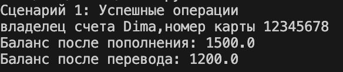

# python_labs2

## Лабораторная работа №1  Bank Account
### Описание 
Этот проект представляет собой систему управления банковскими счетами, разработанную в учебных целях. Система позволяет создавать банковские счета, управлять балансом, выполнять переводы между счетами и отслеживать статус активности счетов.

### Структура
Проект состоит из трех основных файлов:

validators.py — модуль с функциями валидации

model.py — основной класс BankAccount

demo.py — демонстрационные сценарии

Детальное описание файлов
1. validators.py — Валидация данных
Этот файл содержит функции для проверки всех данных, которые попадают в систему. 

Функции валидации:

val_owner(owner) — проверяет имя владельца

Должно быть строкой

Не может быть пустым

Содержит только буквы, пробелы и дефисы

val_number(number) — проверяет номер счета

Должен быть строкой

Содержит от 8 до 16 цифр

Игнорирует пробелы и дефисы

val_balance(balance) — проверяет баланс

Должен быть числом

Не может быть отрицательным

Округляется до 2 знаков

val_amount(amount) — проверяет сумму операции

Должна быть числом

Должна быть больше 0

val_currency(currency, allowed) — проверяет валюту

Должна быть строкой

Должна быть в списке разрешенных валют

val_active(is_active) — проверяет статус активности

Должен быть булевым значением

val_status_change(current, new) — проверяет изменение статуса

Статус не может быть изменен на тот же самый

2. model.py — Класс BankAccount
Это сердце проекта. Здесь реализован сам банковский счет со всеми его методами.

Мой подход к разработке класса:

Я использовала инкапсуляцию — все важные данные (номер счета, баланс) сделал приватными. Для доступа к балансу использовала @property, что позволяет контролировать изменения.

Атрибуты класса:

owner — владелец счета

_number — номер счета (приватный)

_balance — баланс (приватный)

currency — валюта

is_active — статус активности

_transaction_history — история операций

Основные методы класса:

top_up(amount) — пополнение счета

withdraw(amount) — снятие средств

transfer_to(target, amount) — перевод на другой счет

set_active_status(status) — изменение статуса

Я выбрала такую архитектуру, потому что хотел, чтобы класс был максимально приближен к реальному банковскому счету. Все операции проверяют:

Достаточно ли средств

Активен ли счет

Корректна ли сумма

3. demo.py — Демонстрация работы
Этот файл показывает, как система работает в реальных сценариях. Я создал несколько сценариев, чтобы проверить разные ситуации.

Сценарии:

Успешные операции — демонстрация нормальной работы

Недостаточно средств — проверка обработки ошибок

Ошибочные данные — тестирование валидации при создании счета

